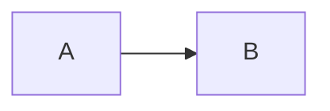

# docs-kit

A small kit for self-contained HTML documents: design tokens and components in `doc.css`, behaviours and a
component loader in `doc.js`, one custom element per file in `components/`, and pinned third-party libraries in
`vendor/`. Documents open straight from disk (`file://`) — no build step, no server.

`gallery.html` runs every component and is the page to check after changing anything.

## Use it

One tag is enough — the kit links its own stylesheet, builds the page frame and the contents sidebar, and gives
headings their anchors:

````html
<!doctype html>
<html lang="en">
<meta charset="utf-8">
<title>Page title</title>
<script src="https://cdn.jsdelivr.net/gh/tannc28/docs-kit@v0.1.N/doc.js"></script>

<script type="text/markdown">
# Page title

## A section

</script>
````

Write the page in Markdown (fences `mermaid`, `chart <type>`, `table`/`csv`, `math`, any code language; GitHub alerts
become callouts) or in plain HTML with `<doc-*>` components. Replace `v0.1.N` with a release tag — a tagged URL never
changes — or use `@main` to follow the newest commit. `examples/` holds both kinds of page.

**For AI assistants:** point them at [`llms.txt`](llms.txt) / [`llms-full.txt`](llms-full.txt) (generated from the
code by `bin/build-llms.py`) or [`AGENTS.md`](AGENTS.md): templates, which tool to use for what, and every
component's attribute reference.

A document's own script that needs `window.Docs` waits for the `docs:ready` event (or runs at once when
`Docs.ready` is true).

## Layout

| Path | What |
|---|---|
| `doc.css` | tokens (light/dark) and class components |
| `doc.js` | core behaviours, labels (`#doc-labels` overrides), icons, and the `<doc-*>` component loader |
| `components/` | one custom element per file; the file header is its attribute reference |
| `vendor/` | pinned libraries, listed with URL, license and sha256 in `vendor/manifest.json` |
| `bin/` | `build-llms.py`, `vendor-fetch.py`, `gallery-check.sh`, `verify.py`; `doc-name.sh`, `doc-move.py` and `verify.py <file>` enforce one personal folder convention (`~/Docs`) and are optional |
| `examples/` | one-tag pages: plain HTML, and a page written as one Markdown block |
| `AGENTS.md`, `llms.txt`, `llms-full.txt` | the reference for assistants |

Libraries must be classic UMD/IIFE builds (ES modules and `fetch` fail over `file://`) under a permissive license.
Add one to `vendor/manifest.json`, run `bin/vendor-fetch.py --pin`, and register it in the `LIBS` table of `doc.js`.

## Checks and releases

`.github/workflows/ci.yml` runs on every push:

1. `bin/verify.py --kit` — the kit is English-only
2. `bin/vendor-fetch.py` — every vendored file matches its pinned sha256
3. `node --check` on every script
4. `bin/build-llms.py --check` — the assistant reference matches the component headers
5. `bin/gallery-check.sh` — the gallery and the example pages render in headless Chrome and every kind of component drew

A push to `main` that passes is tagged `v0.1.<run>`, released on GitHub, and requested once from jsDelivr so the
CDN copy is ready. Versions stay at 0.x while nothing depends on the kit publicly: any release may change markup.
