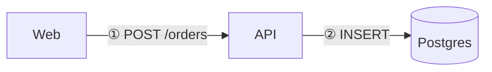

# docs-kit

One script tag turns short Markdown or plain HTML into a finished, self-contained documentation page: layout,
contents sidebar, light/dark theme, diagrams, charts, sortable tables, maps, code, maths, terminal replays and API
references. No build step, no server, no hand-drawn SVG. Made to be written quickly — by people and by AI assistants.

## Quick start

Save this as `page.html` and open it:

````html
<!doctype html>
<html lang="en">
<meta charset="utf-8">
<title>Checkout service</title>
<script src="https://cdn.jsdelivr.net/gh/tannc28/docs-kit@v0.2.0/doc.js"></script>

<script type="text/markdown">
# Checkout service

How an order moves from the cart to the database.

## Flow



## Orders per hour

```chart bar
Hour,Orders,Failed
08,40,1
09,96,2
10,120,31
```

> [!WARNING]
> Payment callbacks time out after 2 s.
</script>
````

The kit links its own stylesheet, builds the page frame and the contents sidebar from the headings, and loads each
library only when the page uses it. The URL names a release: its files never change, so a page keeps working as it
was written.

## What you can write

In Markdown, a fenced block picks the tool by the word after the backticks:

| Fence | Draws |
|---|---|
| ` ```mermaid ` | any Mermaid diagram: flowchart, sequence, class, state, ER, Gantt, mind map, timeline, quadrant, radar, treemap, sankey… |
| ` ```chart bar ` / `line` / `area` / `hbar` / `pie` / `donut` / `scatter` + CSV | a chart; first column is the x axis |
| ` ```chart ` + JSON | any Apache ECharts option |
| ` ```vega-lite ` + JSON | a Vega-Lite chart (aggregate, bin, facet declared in the spec) |
| ` ```table ` / ` ```csv ` / ` ```tsv ` | a sortable table |
| ` ```terminal ` | a terminal session that replays (lines starting with `$ ` are commands) |
| ` ```cron ` | cron expressions explained in English |
| ` ```openapi ` + YAML or JSON | a full API reference |
| ` ```math ` | a LaTeX formula (also `$inline$` and `$$ … $$`) |
| ` ```python ` (any language) | highlighted code with a copy button |

Also: normal Markdown tables (styled, numbers right-aligned, sortable), GitHub alerts `> [!NOTE]` / `[!TIP]` /
`[!IMPORTANT]` / `[!WARNING]` / `[!CAUTION]` as callouts, and footnotes `[^1]`.

For everything else there are `<doc-*>` elements, usable inside the Markdown or in plain HTML: `doc-figure` (image
with numbered pins), `doc-note` (annotation badge on any element), `doc-tour` (guided walk through the page),
`doc-compare`, `doc-diff`, `doc-json`, `doc-tabs`, `doc-timeline`, `doc-graph`, `doc-map`, `doc-device`,
`doc-term`, `doc-mark`, `doc-icon`, `doc-steps`, `doc-flow`, `doc-scrolly`, `doc-seq`, `doc-zoom`, `doc-sketch`,
`doc-arrow`, `doc-code`, `doc-math`, `doc-table`, `doc-chart`, `doc-vega`, `doc-cast`, `doc-cron`, `doc-openapi`.
Each file in `components/` starts with its full attribute reference.

## For AI assistants

Give the assistant this line with the task:

> Write the page as one HTML file with docs-kit. Follow https://cdn.jsdelivr.net/gh/tannc28/docs-kit@v0.2.0/llms-full.txt

- [`llms.txt`](llms.txt) — the short index ([llmstxt.org](https://llmstxt.org) format)
- [`llms-full.txt`](llms-full.txt) — the page template, which tool to use for what, the rules for a good page, and
  the attribute reference of every component, in one file
- [`AGENTS.md`](AGENTS.md) — the same guide without the component reference

`llms-full.txt` is generated from `AGENTS.md` and the component source by `bin/build-llms.py`, so it cannot drift
from the code: CI fails when it is stale.

## See it

Clone the repository and open `gallery.html` (every component running) or the pages in `examples/`. They load the
kit from the working copy, so they also show unreleased changes. jsDelivr serves HTML files as plain text, so these
pages cannot be viewed through the CDN.

## Use it offline

The repository is the whole kit. Copy or clone it anywhere and point at its `doc.js`:
`<script src="path/to/docs-kit/doc.js"></script>`. Every library it uses is vendored in `vendor/`, so nothing is
fetched from the network — except map tiles for `doc-map`.

## Layout

| Path | What |
|---|---|
| `doc.js` | the runtime: Markdown, page frame, sidebar, tables, labels, icons, and the loader for `<doc-*>` components |
| `doc.css` | design tokens (light/dark) and class components (callouts, KPI tiles, cards, badges, tables, mocks) |
| `components/` | one custom element per file; line 1 of its header is a one-line summary, the rest its attribute reference |
| `vendor/` | pinned third-party libraries; `vendor/manifest.json` lists each with URL, license and sha256 |
| `examples/` | a one-tag HTML page and a page written as one Markdown block |
| `gallery.html` | every component running — the page to check after changing anything |
| `AGENTS.md`, `llms.txt`, `llms-full.txt` | the guide for assistants |
| `VERSION` | the release this commit belongs to |
| `bin/` | `build-llms.py`, `vendor-fetch.py`, `gallery-check.sh`, `verify.py --kit`; `doc-name.sh`, `doc-move.py` and `verify.py <file>` serve one personal folder convention (`~/Docs`) and are optional |

## Libraries

Mermaid, Apache ECharts, Vega-Lite, Cytoscape.js (+ dagre), highlight.js, KaTeX, marked (+ footnote and KaTeX
extensions), PapaParse, js-yaml, Redoc, asciinema-player, cronstrue, driver.js, CountUp.js, MapLibre GL, Turf,
Rough.js, Rough Notation, Scrollama, diff2html (+ jsdiff), Lucide, devices.css, Open Props, Inter, JetBrains Mono.
All MIT, ISC, BSD, Apache-2.0, CC0 or OFL; each license file is vendored next to the library.

A library joins the kit only if it ships a classic UMD/IIFE build (ES modules and `fetch` fail over `file://`), is
permissively licensed and maintained, and lets an author show more with less writing. Add it to
`vendor/manifest.json`, run `bin/vendor-fetch.py --pin`, register it in the `LIBS` table of `doc.js`, and load it
with `Docs.lib(name)`.

## Rules for the kit itself

- **Generic and English-only.** Nothing in the kit exists for one document; `verify.py --kit` fails on any
  Vietnamese text. A document that needs other control labels overrides them with a `#doc-labels` JSON block.
- **Pages say where their numbers come from**; figures default to one static picture with numbered notes.

## Checks and releases

`.github/workflows/ci.yml` runs on every push:

1. `bin/verify.py --kit` — the kit is English-only
2. `bin/vendor-fetch.py` — every vendored file matches its pinned sha256
3. `node --check` on every script
4. `bin/build-llms.py --check` — the assistant guide matches the code and names the release in `VERSION`
5. `bin/gallery-check.sh` — the gallery and the example pages render in headless Chrome and every kind of component drew

To release: bump `VERSION`, run `bin/build-llms.py` (it writes the new version into every kit URL in the guide and
this README), commit, push to `main`. When the checks pass, CI tags `v<VERSION>`, publishes a GitHub release and
requests the files once from jsDelivr. A push that does not change `VERSION` is checked but not released. Versions
stay at 0.x while nothing depends on the kit publicly: a minor release may change markup.
